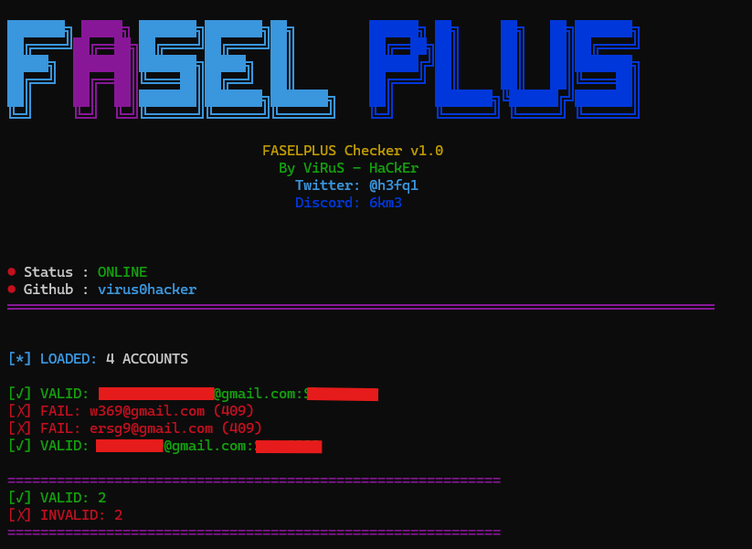

# 🚀 FaselPlus Account Checker v1.0

**FaselPlus Checker** is a high-performance tool designed for security researchers and penetration testers to verify account credentials for the FaselPlus platform. This tool is optimized to bypass rate-limiting and detection systems using advanced rotation techniques.

---

## ✨ Key Features | المميزات الرئيسية

- 🛡️ **Anti-Rate Limit:** Integrated system to handle `HTTP 429` errors automatically.
- 🔄 **User-Agent Rotation:** Switches between multiple real-world browser fingerprints to avoid bot detection.
- 🌐 **Proxy Support:** Full support for HTTP/HTTPS proxies to mask your identity and increase speed.
- ⚡ **Optimized Performance:** Efficient request handling with customizable delays.
- 📊 **Detailed Summary:** Clear reporting of Valid, Invalid, and Failed accounts.
- 📁 **Auto-Save:** Automatically saves all valid hits to `valid_accounts.txt`.

---

## 💰 Purchase | الشراء

If you want the full version or need custom modifications:

    Discord: @6km3
    Twitter: @h3fq1
    Telegram: @chwof

ViRuS - HaCkEr
